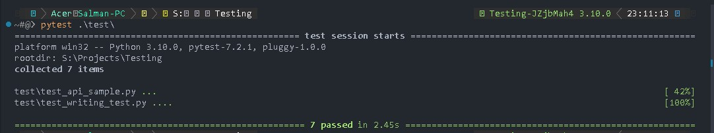

# API testing with pytest and requests

### Author: [Salman Sayyed](https://github.com/sayyed-salman)

## Description

This is a simple API testing framework using pytest and requests. It is a simple framework to get started with API testing.

## Installation

1. Clone the repository
2. Install the requirements with pipenv

```bash
pip install pipenv
pipenv install
pipenv install --dev
```

3. Learn more about pipenv [here](https://pipenv.pypa.io/en/latest/)

## Testing

1. After installing the requirements, run the following command to run the tests

```bash
pytest ./test/
```

Results will be displayed in the terminal.



## Code

- The code we are testing is stored in the `dev` folder
- The tests are stored in the `test` folder
- To edit or update the code go in the `dev\api_sample.py` file
- Code is pretty self explanatory
